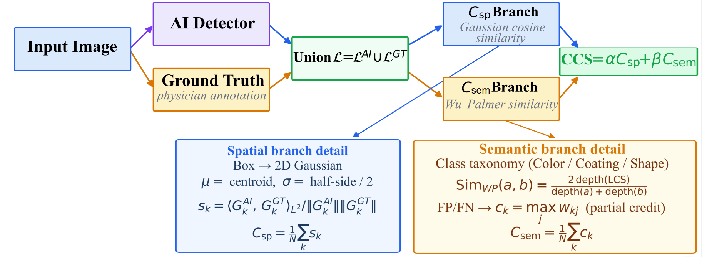
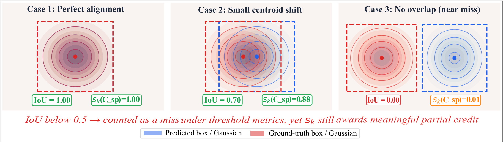
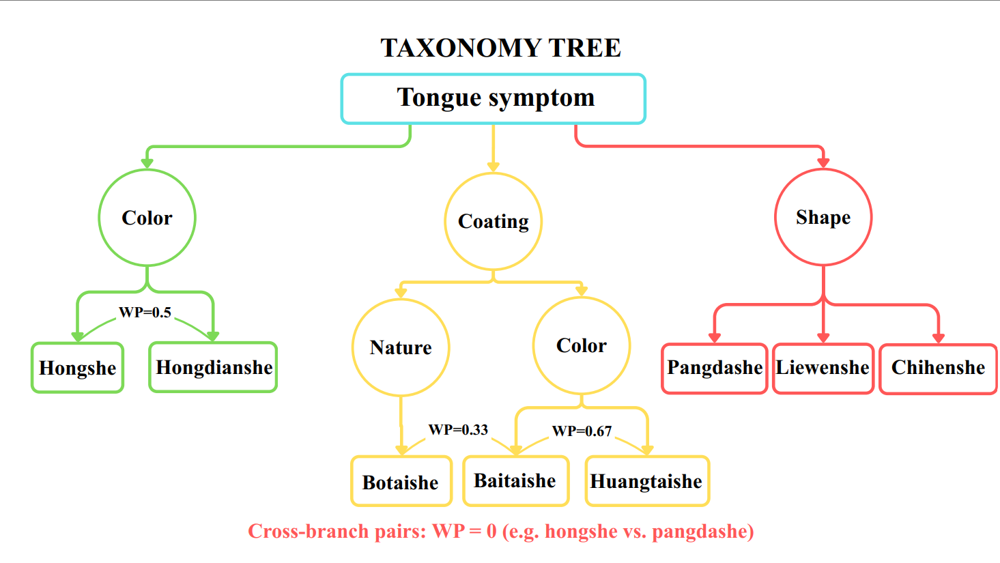
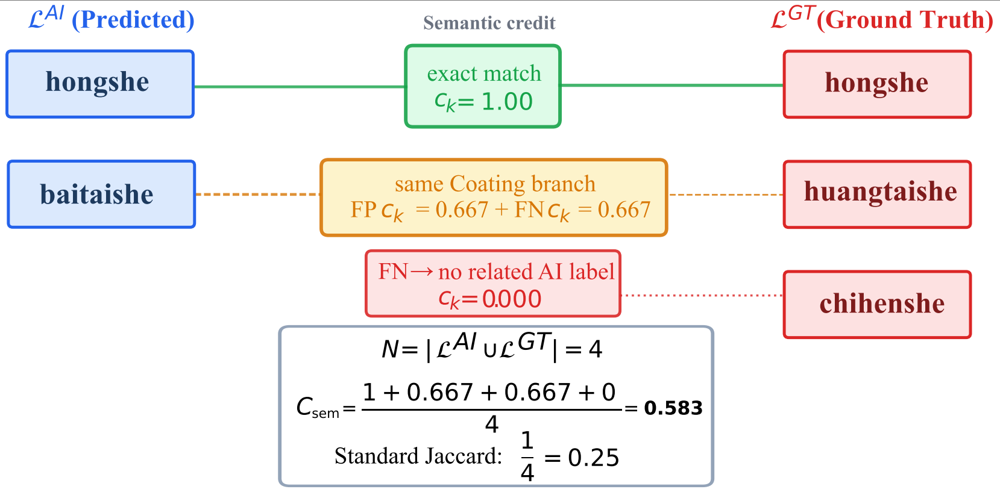
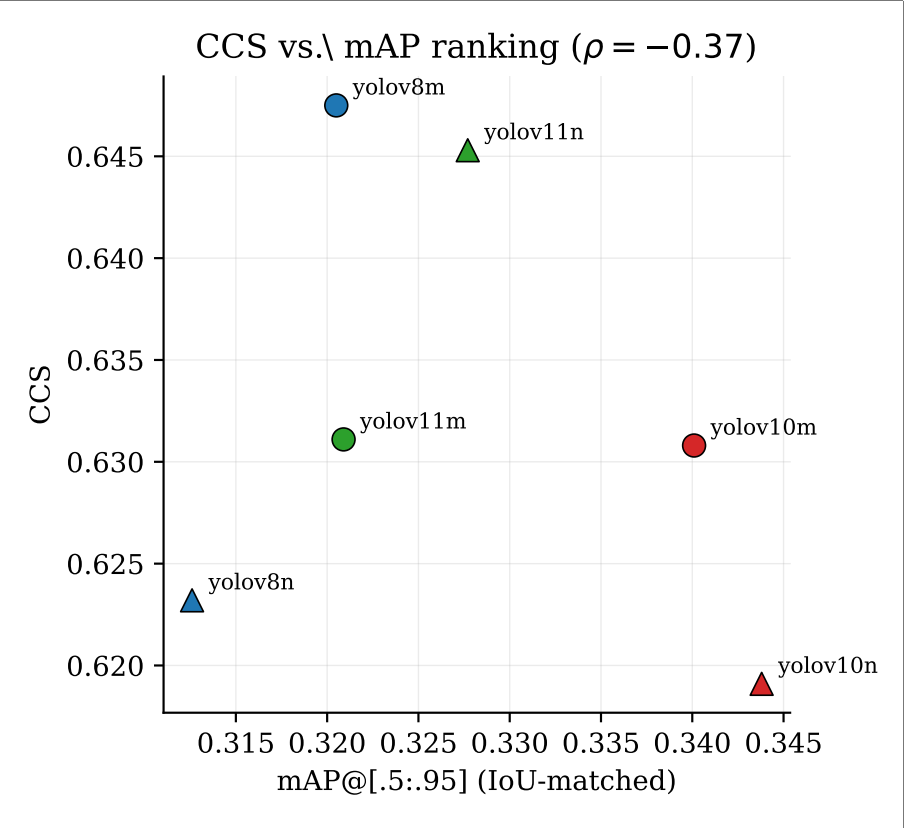
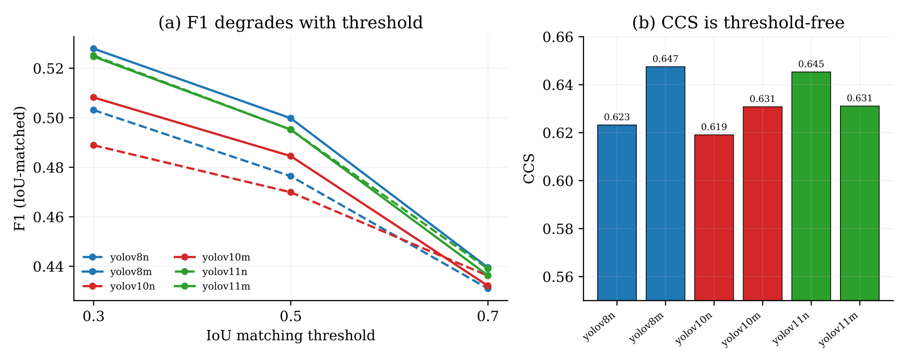
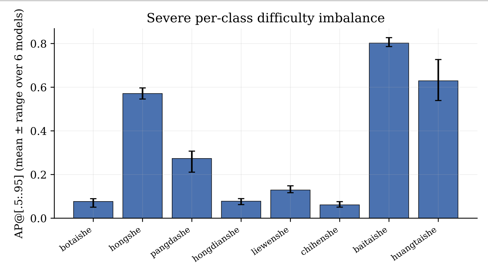
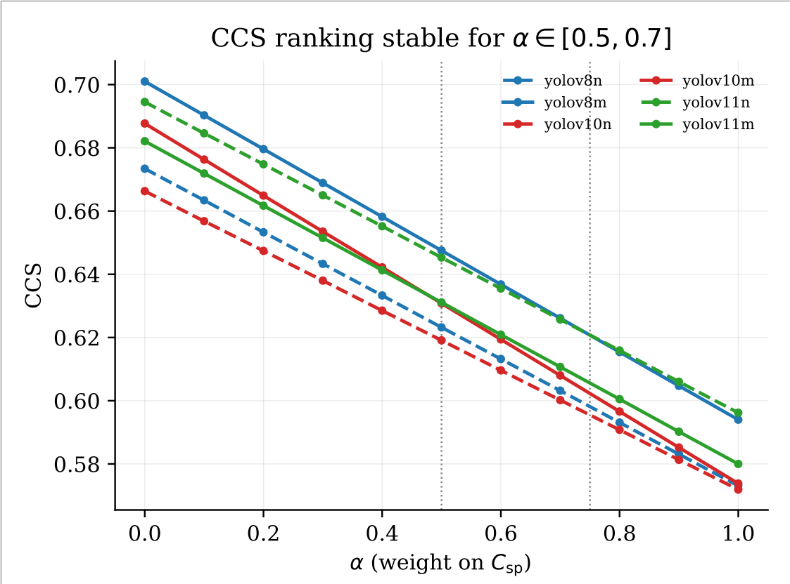

# TongueTriage: Continuous Concordance Score (CCS) for TCM Tongue Diagnosis

## Citation

If you use this work or metric in your research, please cite:

Quoc Thai Mai. *CCS: A Continuous Spatial-Semantic Concordance Score for Robust Evaluation of Object Detection Models*, 30 July 2026, PREPRINT (Version 1) available at Research Square [[DOI: 10.21203/rs.3.rs-10531409/v1](https://doi.org/10.21203/rs.3.rs-10531409/v1)]

```bibtex
@article{mai2026ccs,
  title={CCS: A Continuous Spatial-Semantic Concordance Score for Robust Evaluation of Object Detection Models},
  author={Mai, Quoc Thai},
  journal={Research Square},
  year={2026},
  doi={10.21203/rs.3.rs-10531409/v1},
  note={Preprint (Version 1)}
}
```

TongueTriage is a repository for the research proposing the **Continuous Concordance Score (CCS)** — a novel evaluation metric designed to compare AI (Object Detection) predictions with doctor annotations in Traditional Chinese Medicine (TCM) tongue diagnosis.

Traditional object detection metrics like mAP (based on IoU) often rely on hard thresholds, which fail to reflect the "flexible" nature of medical diagnosis. CCS addresses this limitation by combining two components:

1. **$C_{sp}$ (Spatial Concordance)**: Spatial alignment based on a 2D Gaussian density function (Gaussian overlap) rather than IoU or hard buffers.
2. **$C_{sem}$ (Semantic Concordance)**: Semantic alignment between predicted labels and ground-truth, utilizing a taxonomy tree and Wu-Palmer similarity.

**General Formula:**
$$CCS = \alpha \cdot C_{sp} + \beta \cdot C_{sem}$$



---

## 1. Continuous Concordance Score (CCS) Details

### 1.1 Spatial Concordance ($C_{sp}$)

$C_{sp}$ uses a Gaussian Distance Decay model. Each bounding box is represented as a 2D Gaussian distribution, smoothly handling variations in bounding box sizes drawn by AI and doctors.



Instead of a binary IoU threshold, $C_{sp}$ computes the normalized inner product (cosine similarity) between the two Gaussian functions, continuously penalizing scale differences and the distance between box centers.

### 1.2 Semantic Concordance ($C_{sem}$)

$C_{sem}$ relies on a provisional clinical taxonomy of 8 tongue symptom classes (Color, Coating, Shape) and computes the Wu-Palmer similarity between predicted and ground-truth labels. 




This allows the metric to assign partial credit for "near-miss" semantic predictions (e.g., predicting "red tongue" instead of "red-spotted tongue") rather than applying a strict 0 penalty.

---

## 2. Dataset and Models

The repository uses an 8-class subset of the TMC-Tongue dataset, located in `shezhen datasets/shezhenv3-8class/`. 

The 8 classes are:
- `0`: botaishe (Thin coating)
- `1`: hongshe (Red tongue)
- `2`: pangdashe (Swollen tongue)
- `3`: hongdianshe (Red-spotted tongue)
- `4`: liewenshe (Cracked tongue)
- `5`: chihenshe (Teeth-marked tongue)
- `6`: baitaishe (White coating)
- `7`: huangtaishe (Yellow coating)

Pre-trained YOLO weights (YOLOv8, YOLOv10, YOLOv11) are included in the repository for immediate evaluation.

---

## 3. Training and Evaluation Guide

### 3.1 Environment Setup

Ensure you have Python installed and install the required dependencies:
```bash
pip install -r requirements.txt
```

### 3.2 Data Preparation

Before training, you must extract the 8-class subset from the original full dataset (which contains 20 classes). You can do this by running the `prepare_8class.py` script. It filters the original dataset and creates a new directory containing only the images and annotations for the chosen 8 classes.

```bash
python prepare_8class.py
```
*(Note: If necessary, check and update the `ROOT` and `OUT` paths inside `prepare_8class.py` to match your local machine's directory structure).*

### 3.3 Training the YOLO Models

We provide scripts to train YOLO models on the 8-class dataset (`train_8class.py`) and the full 20-class dataset (`train_yolo.py`). The commands and parameters are identical for both scripts.

**Train a single model (e.g., YOLOv10m):**
```bash
python train_8class.py single --model yolov10m.pt --epochs 100 --imgsz 640 --batch 16 --device 0
```

**Train multiple models sequentially:**
```bash
python train_8class.py all --models yolov8n,yolov8m,yolov10n,yolov10m,yolov11n,yolov11m --epochs 100 --imgsz 640 --batch 16 --device 0
```

**Test a trained model:**
```bash
python train_8class.py test --weights runs/train/yolov10m-imgsz640-e100/weights/best.pt
```

Key arguments:
- `--data`: Path to the YAML dataset (defaults to the 8-class YAML for `train_8class.py`).
- `--device`: GPU index (e.g., `0`) or `cpu`.
- `--exist-ok`: Overwrite existing experiment folders without creating new ones.

---

## 4. Reproducing the Benchmark Experiments

After training, you can run the benchmark scripts to evaluate the models using CCS and compare them against traditional metrics (mAP). All results are saved in `runs/experiments/`.

### Experiment 1: CCS vs. mAP and Threshold Sensitivity
Runs the full evaluation, comparing CCS with mAP (at various IoU thresholds) and analyzing edge cases.
```bash
python experiments_ccs_v2.py
```




### Experiment 2: Normalized Wasserstein Distance (NWD) Baseline
Compares CCS against the NWD metric designed for small object detection.
```bash
python nwd_baseline.py
```

### Experiment 3: Alpha & Beta Optimization
A data-driven approach to finding the optimal weights ($\alpha$ and $\beta$) for the Spatial and Semantic concordance components.
```bash
python alpha_beta_optimization.py
```


### Experiment 4: Statistical Significance Tests
Performs statistical tests (e.g., Wilcoxon signed-rank test) to determine if the performance differences measured by CCS are statistically significant.
```bash
python stats_tests.py
```

### Experiment 5: Near-Miss Analysis
Focuses on cases where the model's prediction is very close to the ground truth (spatially or semantically) but is penalized heavily by traditional binary metrics.
```bash
python run_near_miss.py
```
